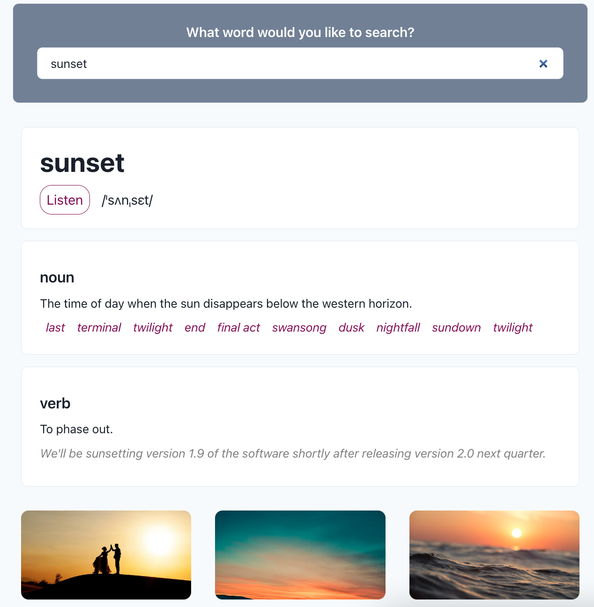

# React-dictionary-application

## Table of content

- [Description of Project](#description)
- [Link to deployed application](#link-to-deployed-page)
- [Screenshot of deployed application](#screenshot-of-deployed-page)

## Description

This app is a dictionary search that uses a word and image API.

When I search for a word then I am presented with the definition, phonetic, synonyms and images related to this word.

### Link to deployed page

https://simple-react-weather-app-ac.netlify.app

#### Screenshot of deployed page

